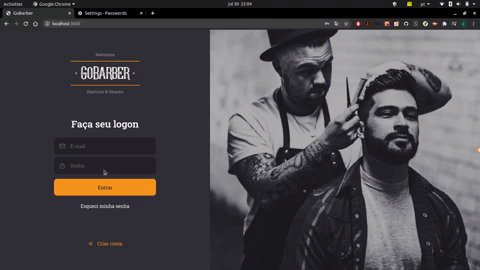

<p align="center">
  
  
</p>

<h1></h1>

<p>
  
  <a href="#" target="_blank">
    
  </a>
  <a href="#" target="_blank">
    
  </a>

  <a href="#" target="_blank">
    
  </a>
</p>
 
>Um app para facilitar na hora de marcar um horário com algum barbeiro, podendo ver os horários disponíveis de cada barbeiro cadastrado no app, via app Mobile. O barbeiro também pode via aplicação Web ver os seus agendamentos, podendo escolher os dias
<p align="center">
  
  
</p>

<p align="center">
  
  
</p>


## 🏗 Instalação
- Possuir [NodeJs]() e [Yarn]() instalado, clone o projeto com os seguintes comandos:
  ```sh
  git clone https://github.com/LucasAugustoCastro/GoBarberGoStack.git
  ```
- Para que sua aplicação rode, lembre-se de possuir o [postgress](), [mongodb]() e [redis]() instalado

- Entre na pasta BackEnd GoBarber

  - Crie suas configurações do banco seguindo exemplo ormconfig.example.json
    ```sh
    cp ormconfig.example.json ormconfig.json
    ```
    Não se esqueca de colocar novos valores após copiar os exemplos. Verifique se as portas usadas pelos bancos são as mesmas que a do arquivo

  - Não esqueça de verificar se o postgreSQL e o MongoDB estão realmente usando as portas especificadas
  - Crie suas variaveis ambiente seguindo o .env.examples
    ```sh
    cp .env.example .env
    ```
    Não se esqueca de colocar novos valores após copiar os exemplos
## 🚴‍♂️️ Iniciando o projeto
- Use o comando **yarn** para fazer a instalaçao das dependencia (lembre-se que sera necessario rodar esse comando nas tres pastas)
- Após rodar o yarn vá até a pasta BackEnd GoBarber e rode o seguinte comando para criar as tabelas no banco:
    ```sh 
    yarn typeorm migration:run
    ```


## 👀️ Rodar o projeto
Para rodar o Back-end:

```sh
yarn dev:server
```
Para rodar o Front-end e o Mobile:

```sh
yarn start
```

## 🍵️ Rodar os testes

```sh
yarn test
```

## Autor

👤 **Lucas Castro**

* Website: https://github.com/LucasAugustoCastro
* Github: [@LucasAugustoCastro](https://github.com/LucasAugustoCastro)
* LinkedIn: [@https:\/\/www.linkedin.com\/in\/lucasaugustocastro\/](https://linkedin.com/in/https:\/\/www.linkedin.com\/in\/lucasaugustocastro\/)

## Montre seu apoio

Dê uma ⭐️ se o projeto ajudou você!

## 📝 License

Copyright © 2020 [Lucas Castro](https://github.com/LucasAugustoCastro).<br />
This project is [MIT](https://github.com/LucasAugustoCastro/GoBarberGoStack/blob/master/LICENSE) licensed.
